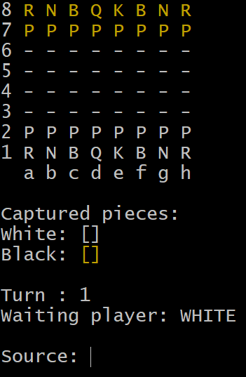

<h1 align="center">
    :chess_pawn:CHESS GAME:chess_pawn:
</h1>
<h4 align="center">
    This project is a chess game made with Java. 
    It has the purposes to apply the knowledge of OOP concepts
    and data structure.
</h4>
<h3>
    :round_pushpin:Concepts applied in the project
</h3>

**Topics:**
- Abstraction
- Associations
- Constructors
- Downcasting
- Encapsulation
- Enumerations
- Exceptions
- Inheritance
- Matrix
- Overloading
- Overriding
- Polymorphism

<h2 align="center"> 
    :sparkles:Diagram:sparkles: 
</h2>

    <h2>:sparkles:Output:sparkles:</h2>
    

